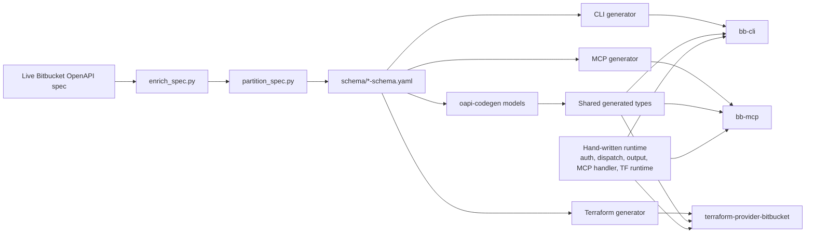
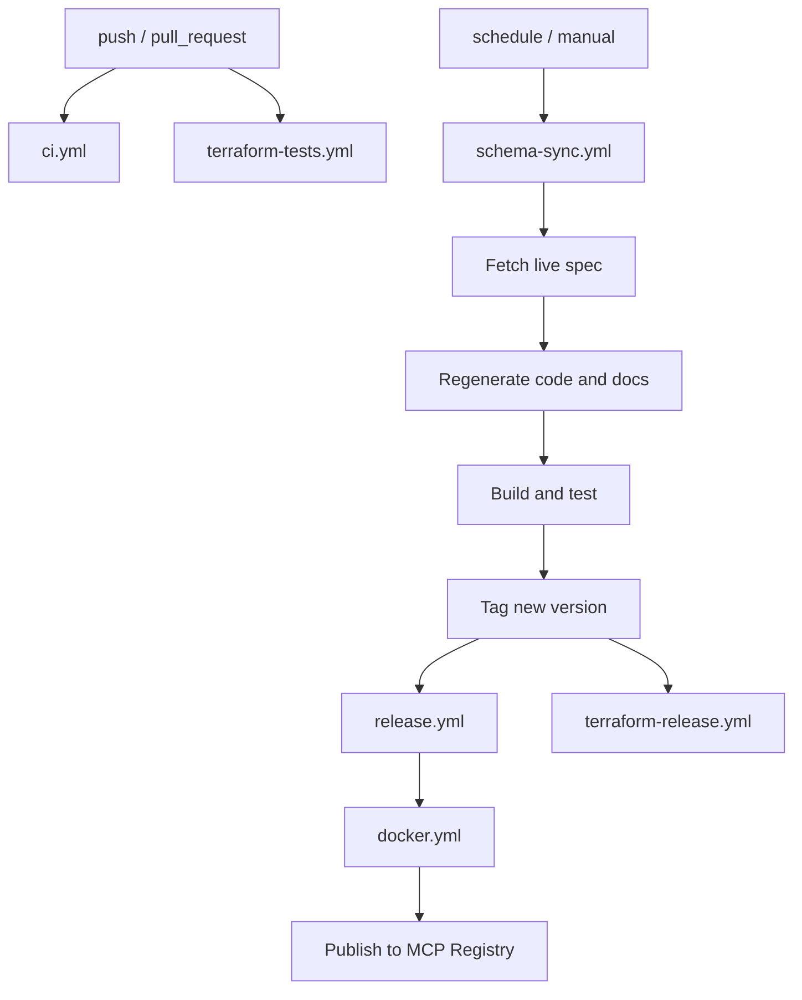

# bitbucket-cli

Low-maintenance Bitbucket Cloud tooling built from the live OpenAPI spec: a CLI for software engineers, an MCP server for AI agents, and a Terraform provider for DevSecOps teams.

> [!IMPORTANT]
> `https://github.com/FabianSchurig/bitbucket-cli` is the canonical repository.
> If you found this project through the `terraform-provider-bitbucket` mirror, watch, star, file issues, and contribute in `bitbucket-cli`.

## Start here

| Audience | Best fit | Start here |
| --- | --- | --- |
| DevSecOps engineers | Terraform provider | [Terraform Registry](https://registry.terraform.io/providers/FabianSchurig/bitbucket/latest), [generated provider docs](./docs/index.md), [example: `bitbucket_tags`](https://registry.terraform.io/providers/FabianSchurig/bitbucket/latest/docs/resources/tags) |
| Software engineers / computer scientists | `bb-cli` | [CLI usage guide](./docs/cli.md) |
| AI agents / agent platform users | `bb-mcp` | [MCP usage guide](./docs/mcp.md) |

## Quick links

- [Canonical GitHub repository](https://github.com/FabianSchurig/bitbucket-cli)
- [Terraform Registry: `FabianSchurig/bitbucket`](https://registry.terraform.io/providers/FabianSchurig/bitbucket/latest)
- [Mirror repository: `terraform-provider-bitbucket`](https://github.com/FabianSchurig/terraform-provider-bitbucket)
- [GitHub Releases](https://github.com/FabianSchurig/bitbucket-cli/releases)
- [SonarQube Cloud](https://sonarcloud.io/project/overview?id=FabianSchurig_bitbucket-cli&organization=fabianschurig)
- [Contributing guide](./CONTRIBUTING.md)

## What this project is

This repository keeps Bitbucket Cloud tooling maintainable by generating most of the surface area from the live Bitbucket OpenAPI spec.

- **One API description, three user-facing tools**: CLI, MCP, and Terraform all come from the same schema pipeline.
- **Thin hand-written runtime**: auth, dispatch, output, and Terraform runtime stay generic instead of growing per-endpoint glue.
- **Fast spec adoption**: new Bitbucket endpoints flow in through generation instead of large manual rewrites.
- **Maintenance-first design**: the main development effort goes into the shared generators and runtime, not duplicated endpoint code.

## Architecture

In practice:

- **CLI** exposes Bitbucket operations as terminal commands.
- **MCP** exposes the same operations as tool calls for AI agents.
- **Terraform** maps operation groups into generic resources and data sources.
- **Hand-written code stays small on purpose**; generated code handles endpoint coverage.

## CI pipelines

- **`ci.yml`**: builds, lints, vets, runs Go tests, and sends analysis to SonarQube Cloud.
- **`terraform-tests.yml`**: runs mock-based Terraform acceptance and `terraform test` suites, plus real API tests when credentials exist.
- **`schema-sync.yml`**: daily/manual sync that fetches the live Bitbucket spec, regenerates generated artifacts, rebuilds docs, tests everything, and tags a release when the schema changed.
- **`release.yml`**: publishes tagged binary releases via GoReleaser.
- **`docker.yml`**: builds multi-arch container images for `bb-cli` and `bb-mcp`, pushes them to GHCR, and publishes the `bb-mcp` server to the [MCP Registry](https://registry.modelcontextprotocol.io).
- **`terraform-release.yml`**: mirrors the tagged source into `terraform-provider-bitbucket` and publishes the Terraform provider release.

## How this differs from `DrFaust92/terraform-provider-bitbucket`

| Aspect | `DrFaust92/terraform-provider-bitbucket` | `FabianSchurig/bitbucket` |
| --- | --- | --- |
| Maintenance model | Hand-written provider resources | Mostly generated from the live Bitbucket OpenAPI spec |
| Scope | Terraform provider only | Terraform provider + CLI + MCP server in one canonical repo |
| API coverage model | Curated, typed resources | Broad endpoint coverage through grouped generic resources/data sources |
| Update flow | Manual feature work per resource | Schema sync pipeline regenerates code and docs |
| Resource shape | Resource-specific typed fields | Generic params, response fields, and raw API response |
| Best fit | Opinionated Terraform workflows | Teams that want fast Bitbucket API coverage and shared tooling across Terraform, shells, and AI agents |

This project optimizes for breadth, maintenance, and shared infrastructure across interfaces. If you want a heavily hand-modeled Terraform UX, the DrFaust92 provider may feel more familiar. If you want one maintained pipeline that keeps Terraform, CLI, and MCP aligned with Bitbucket Cloud, this repository is designed for that.

## Documentation map

Use the short guides on this first page to get started, then switch to the detailed docs for the interface you need.

- **CLI**: [docs/cli.md](./docs/cli.md)
- **MCP**: [docs/mcp.md](./docs/mcp.md)
- **Terraform provider docs**: [docs/index.md](./docs/index.md) and the [Terraform Registry docs](https://registry.terraform.io/providers/FabianSchurig/bitbucket/latest)

The Terraform documentation under `docs/` is generated. The root README stays focused on orientation, links, architecture, maintenance, and contribution entry points.

## Maintenance and contributions

- Read [CONTRIBUTING.md](./CONTRIBUTING.md) before changing generators or runtime code.
- Do not hand-edit generated files; fix the generator or schema source instead.
- Prefer changes that improve the shared pipeline or hand-written runtime across all endpoints.
- Open issues and pull requests in the canonical [`bitbucket-cli`](https://github.com/FabianSchurig/bitbucket-cli) repository.
