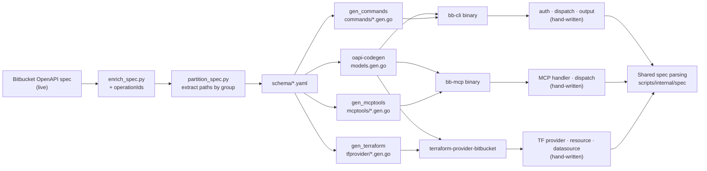

# bitbucket-cli

A low-maintenance CLI, MCP server, and Terraform provider for [Bitbucket Cloud](https://bitbucket.org/). Most code is **auto-generated** from the live Bitbucket OpenAPI spec — only a thin hand-written layer ties it together. A daily CI job fetches the latest spec, regenerates the code, and releases a new version if anything changed.

## Why?

Bitbucket Cloud has no official CLI. Managing pull requests through the web UI is slow when you just want to list, approve, merge, or decline from the terminal. This project fills that gap with three binaries:

- **`bb-cli`** — A command-line interface for all Bitbucket Cloud API endpoints.
- **`bb-mcp`** — A [Model Context Protocol (MCP)](https://modelcontextprotocol.io/) server that exposes all Bitbucket operations as MCP tools.
- **`terraform-provider-bitbucket`** — A [Terraform](https://www.terraform.io/) provider that exposes all Bitbucket operations as resources and data sources.

All three share the same auto-generated foundation:

- **Stays up-to-date automatically** — new API endpoints appear without manual work.
- **Requires near-zero maintenance** — the generic dispatch layer means no per-endpoint glue code.
- **Works everywhere** — Linux, macOS, Windows; install via `go install` or download a binary.
- **Built for AI agents** — designed to be called by coding assistants like GitHub Copilot, Cursor, and similar tools to automate PR workflows: post summaries, add review comments, approve or merge pull requests, and more.

## Architecture



The architecture uses a shared intermediate representation (`OperationDef`) that
CLI, MCP, and Terraform generators all consume. Adding a new consumer requires
only a new generator script and a thin hand-written handler.

## Example Usage

List open pull requests:

```bash
bb-cli pr list-pull-requests --workspace myteam --repo-slug myrepo
```

Add a comment on a pull request:

```bash
bb-cli pr create-acomment-on-apull-request \
  --workspace myteam --repo-slug myrepo --pull-request-id 42 \
  --content-raw "Looks good — approved!"
```

List comments with markdown output (useful for AI agents):

```bash
bb-cli pr list-comments-on-apull-request \
  --workspace myteam --repo-slug myrepo --pull-request-id 42 \
  --output markdown
```

Merge a pull request:

```bash
bb-cli pr merge-apull-request \
  --workspace myteam --repo-slug myrepo --pull-request-id 42
```

See all available PR commands:

```bash
bb-cli pr --help
```

## MCP Server

The `bb-mcp` binary is a Model Context Protocol (MCP) server that exposes all Bitbucket API operations as MCP tools. Each command group (pull requests, repositories, pipelines, etc.) is a single tool with an `operation` parameter — this CRUD-combined design matches how Terraform providers work.

### Quick Start

```bash
# Install
go install github.com/FabianSchurig/bitbucket-cli/cmd/bb-mcp@latest

# Set Bitbucket auth
export BITBUCKET_USERNAME=myuser
export BITBUCKET_TOKEN=<your-api-token>

# Run as stdio MCP server (default, for MCP clients like Claude Desktop)
bb-mcp

# Or run as HTTP SSE server
bb-mcp --transport sse --addr :8080
```

### Configuration for Claude Desktop

Add to your `claude_desktop_config.json`:

```json
{
  "mcpServers": {
    "bitbucket": {
      "command": "bb-mcp",
      "env": {
        "BITBUCKET_USERNAME": "myuser",
        "BITBUCKET_TOKEN": "<your-api-token>"
      }
    }
  }
}
```

### Available Tools

Each tool groups related operations with an `operation` parameter:

| Tool | Operations | Description |
|------|-----------|-------------|
| `bitbucket_pr` | 37 | Pull requests: list, create, merge, approve, comments |
| `bitbucket_repos` | 30 | Repositories: list, create, update, permissions |
| `bitbucket_pipelines` | 68 | Pipelines: runs, steps, variables, caches |
| `bitbucket_issues` | 33 | Issues: list, create, update, comments, attachments |
| `bitbucket_workspaces` | 21 | Workspaces: members, permissions, projects |
| ... | | 20 tool groups total, 352+ operations |

## Terraform Provider

The `terraform-provider-bitbucket` binary is a Terraform provider that exposes all Bitbucket Cloud API operations as resources and data sources. It uses the same auto-generated CRUD mapping from the OpenAPI schema.

### Quick Start

```bash
# Install
go install github.com/FabianSchurig/bitbucket-cli/cmd/bb-tf@latest
```

### Configuration

```hcl
terraform {
  required_providers {
    bitbucket = {
      source = "FabianSchurig/bitbucket"
    }
  }
}

provider "bitbucket" {
  username = "myuser"
  token    = "<your-api-token>"
}
```

Or use environment variables:

```bash
export BITBUCKET_USERNAME=myuser
export BITBUCKET_TOKEN=<your-api-token>
```

### Example Usage

```hcl
# Read a repository
data "bitbucket_repos" "myrepo" {
  workspace = "myteam"
  repo_slug = "myrepo"
}

# Create a pull request
resource "bitbucket_pr" "feature" {
  workspace   = "myteam"
  repo_slug   = "myrepo"
  title       = "My feature PR"
  source_branch_name      = "feature-branch"
  destination_branch_name = "main"
}
```

### Available Resources

Each resource group maps Bitbucket API operations to Terraform CRUD:

| Resource | Operations | Description |
|----------|-----------|-------------|
| `bitbucket_repos` | 30 | Repositories: create, read, update, delete |
| `bitbucket_pr` | 37 | Pull requests: create, read, update, delete |
| `bitbucket_pipelines` | 68 | Pipelines: runs, steps, variables |
| `bitbucket_issues` | 33 | Issues: create, read, update, delete |
| `bitbucket_projects` | 17 | Projects: create, read, update, delete |
| ... | | 20 resource groups total, 352+ operations |

### Migration from DrFaust92/bitbucket

This provider is auto-generated from the complete Bitbucket OpenAPI spec, covering all API endpoints. The DrFaust92/bitbucket provider uses hand-crafted resources with typed attributes. Key differences:

| Aspect | DrFaust92/bitbucket | FabianSchurig/bitbucket |
|--------|-------------------|----------------------|
| Coverage | ~20 resources | 20 resource groups, 352+ operations |
| Maintenance | Manual updates | Auto-generated from live spec |
| Attributes | Typed per-resource | Generic: params + `api_response` JSON |
| State | Per-field state | JSON response + input params |

To migrate, replace resource types and use the generic attribute pattern. For example:

```hcl
# DrFaust92/bitbucket
resource "bitbucket_repository" "repo" {
  owner      = "myteam"
  name       = "myrepo"
  is_private = true
}

# FabianSchurig/bitbucket
resource "bitbucket_repos" "repo" {
  workspace = "myteam"
  repo_slug = "myrepo"
  is_private = "true"
}
```

## Installation

### Go install (recommended)

```bash
# CLI
go install github.com/FabianSchurig/bitbucket-cli/cmd/bb-cli@latest

# MCP server
go install github.com/FabianSchurig/bitbucket-cli/cmd/bb-mcp@latest

# Terraform provider
go install github.com/FabianSchurig/bitbucket-cli/cmd/bb-tf@latest
```

Make sure `$(go env GOPATH)/bin` is in your `PATH`:

```bash
export PATH="$PATH:$(go env GOPATH)/bin"
```

### Shell completion

```bash
# Bash
bb-cli completion bash > /etc/bash_completion.d/bb-cli

# Zsh
bb-cli completion zsh > "${fpath[1]}/_bb-cli"

# Fish
bb-cli completion fish > ~/.config/fish/completions/bb-cli.fish

# PowerShell
bb-cli completion powershell > bb-cli.ps1
```

### Download binary

Download a pre-built binary from the [GitHub Releases](https://github.com/FabianSchurig/bitbucket-cli/releases) page. Archives are available for Linux, macOS, and Windows (amd64/arm64).

### Docker

Two images are published to GHCR on every release:

| Image | Description |
|-------|-------------|
| `ghcr.io/fabianschurig/bitbucket-cli` | CLI (`bb-cli`) |
| `ghcr.io/fabianschurig/bitbucket-mcp` | MCP server (`bb-mcp`) |

Both images use the hardened `dhi.io/golang` base image.

```bash
# CLI
docker pull ghcr.io/fabianschurig/bitbucket-cli:latest

docker run --rm \
  -e BITBUCKET_USERNAME \
  -e BITBUCKET_TOKEN \
  ghcr.io/fabianschurig/bitbucket-cli pr list-pull-requests \
    --workspace myteam --repo-slug myrepo

# MCP server (stdio, e.g. for Claude Desktop)
docker run --rm -i \
  -e BITBUCKET_USERNAME \
  -e BITBUCKET_TOKEN \
  ghcr.io/fabianschurig/bitbucket-mcp

# MCP server (SSE over HTTP)
docker run --rm -p 8080:8080 \
  -e BITBUCKET_USERNAME \
  -e BITBUCKET_TOKEN \
  ghcr.io/fabianschurig/bitbucket-mcp --transport sse --addr :8080
```

#### Building Docker images locally

```bash
# Build CLI image
docker build --target bb-cli -t bb-cli .

# Build MCP server image
docker build --target bb-mcp -t bb-mcp .
```

#### Extending the Dockerfile

Each target is a self-contained stage that installs a binary with `go install`
on the hardened base image. To add a new binary target:

1. Add a new stage that installs the binary with `go install` (use the existing `bb-cli` or `bb-mcp` stages as a template).
2. Add the new target to the build matrix in `.github/workflows/docker.yml` so CI builds and pushes the image automatically.

### Build from source

```bash
git clone https://github.com/FabianSchurig/bitbucket-cli.git
cd bitbucket-cli
go build -o bb-cli ./cmd/...
```

## Contributing

### Dev Container

This repository includes a [Dev Container](https://containers.dev/) configuration that provides a ready-to-use development environment with both **Go** and **Python** pre-installed.

#### Prerequisites

- [Docker](https://www.docker.com/get-started)
- [Visual Studio Code](https://code.visualstudio.com/) with the [Dev Containers extension](https://marketplace.visualstudio.com/items?itemName=ms-vscode-remote.remote-containers), **or**
- [GitHub Codespaces](https://github.com/features/codespaces)

#### Getting started

1. Clone the repository and open it in VS Code.
2. When prompted, click **Reopen in Container**, or run the command **Dev Containers: Reopen in Container** from the Command Palette (`Ctrl+Shift+P` / `Cmd+Shift+P`).
3. VS Code will build the container and install all required tools. This may take a few minutes on the first run.

After the container starts you will have:

- **Go 1.25** – for building and testing the CLI.
- **Python 3.12** – for running the helper scripts under `scripts/`.
- Go and Python VS Code extensions pre-installed and configured.

#### Running the CLI

```bash
go run ./cmd/bb-cli --help
```

#### Running the scripts

```bash
python3 scripts/enrich_spec.py <input.json> <output.json>
```